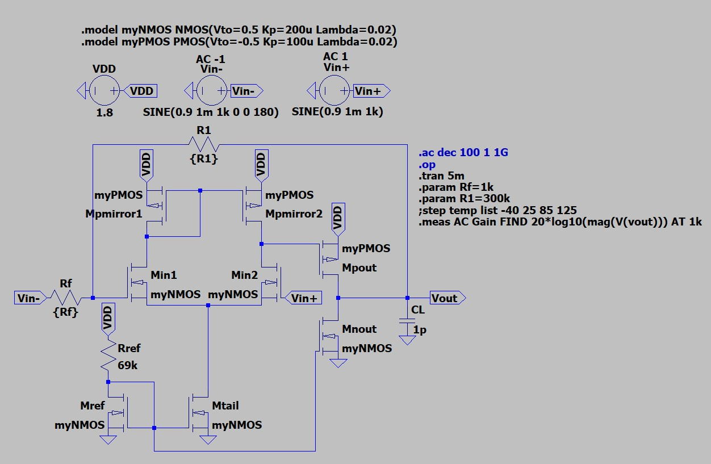
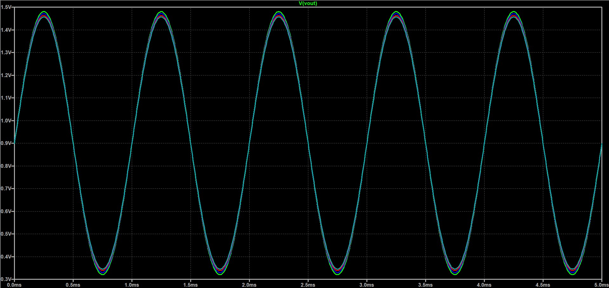
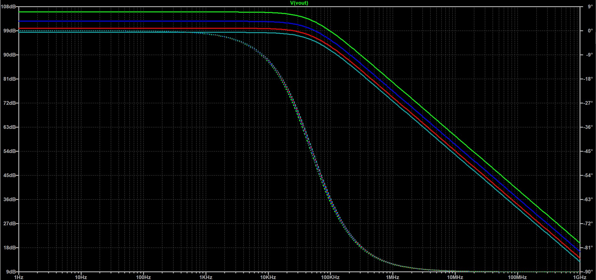
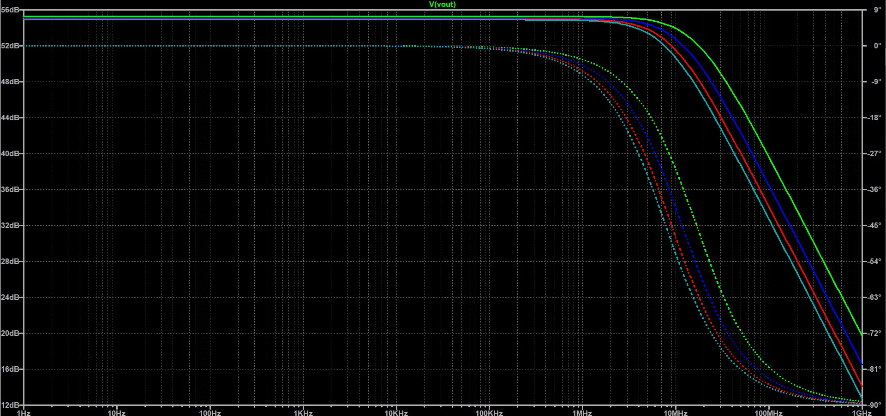
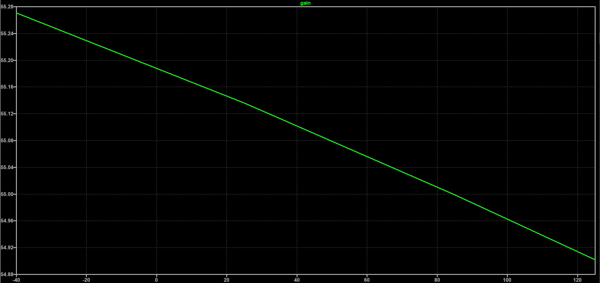
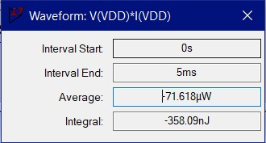

# 1.8V Non Inverting 2 Stage CMOS Miller Op-Amp 

A complete transistor-level 2 Stage CMOS Miller Op-Amp design. The circuit receives a weak 1kHz sine with 1mV Amplitude, amplifies it with 106dB open loop gain  or 55.1dB negative feedback gain (600mV Amplitude, 1kΩ/300kΩ resistor Pair). A NMOS Current Mirror provides the circuit with 16μΑ. One additional Current Mirrors is used (PMOS), to convert the circuit to a signle-output. Finally, the second stage consists of a PMOS and NMOS transistors in a cascode topology. The circuit achieves consumption < 100μJ. The circuit is also tested and evaluated under different temperatures. 

All simulations and validations were performed in **LTspice**.

## Key Specifications

| Parameter | Value / Description |
| :--- | :--- |
| **Technology** | Generic NMOS Vth= 0.5V Kp=200u Lambda=0.02 (W/L) = (4u/1u), Generic NMOS Vth= 0.5V Kp=200u Lambda=0.02 (W/L) = (2u/1u), Generic PMOS Vth=-0.5V Kp=100u Lambda=0.02 (W/L) = (4u/1u)|
| **Supply Voltage (VDD)** | 1.8V |
| **Virtual Ground / DC Bias** | 0V |
| **Input Signal Amplitude** | 1mV |
| **Carrier Frequency** | 1kHz |
| **Current** | 16μΑ |
| **Reference Resistor** | 68kΩ |
| **Negative Feedback Pair Resistors** | 1kΩ/300kΩ |
| **Load Capacitor** | 1pF |
| **Bandwidth** | 0 - 17.8 MHz (Negative Feedback) 0 - 48.3 kHz (open loop)|
| **Midband Gain** | 106dB (open loop), 55.1dB (negative feedback)|

## Transistor W/L Reference Table
| Name |Type | W/L |
| :--- | :--- | :--- |
|**Min1**| NMOS | 2u/1u |
|**Min2**| NMOS | 2u/1u |
|**Mnref**| NMOS | 4u/1u |
|**Mntail**| NMOS | 4u/1u |
|**Mnmirror1**| PMOS | 4u/1u |
|**Mnmirror2**| PMOS | 4u/1u |
|**Mpout**| PMOS | 4u/1u |
|**Mnout**| NMOS | 2u/1u |

## Schematics & Simulation Results

### Schematic

### Transient Analysis
The system was evaluated with the use of a weak 1mV input signal to verify the circuit's gain.

### Negative Feedback (at different temperatures)

- **Green Trace:** Amplified Output Signal at -40C
- **Blue Trace:** Amplified Output Signal at 25C
- **Red Trace:** Amplified Output Signal at 85C
- **Light Blue Trace:** Amplified Output Signal at 125C

### AC Analysis

### Open Loop (at different temperatures)

- **Green Trace:** Gain at -40C
- **Blue Trace:** Gain at 25C
- **Red Trace:** Gain at 85C
- **Light Blue Trace:** Gain at 125C
  
### Negative Feedback (at different temperatures)

- **Green Trace:** Gain at -40C
- **Blue Trace:** Gain at 25C
- **Red Trace:** Gain at 85C
- **Light Blue Trace:** Gain at 125C

### Open Loop Gain As a function of temperature

### Negative Feedback Gain As a function of temperature

### Consumption

---
